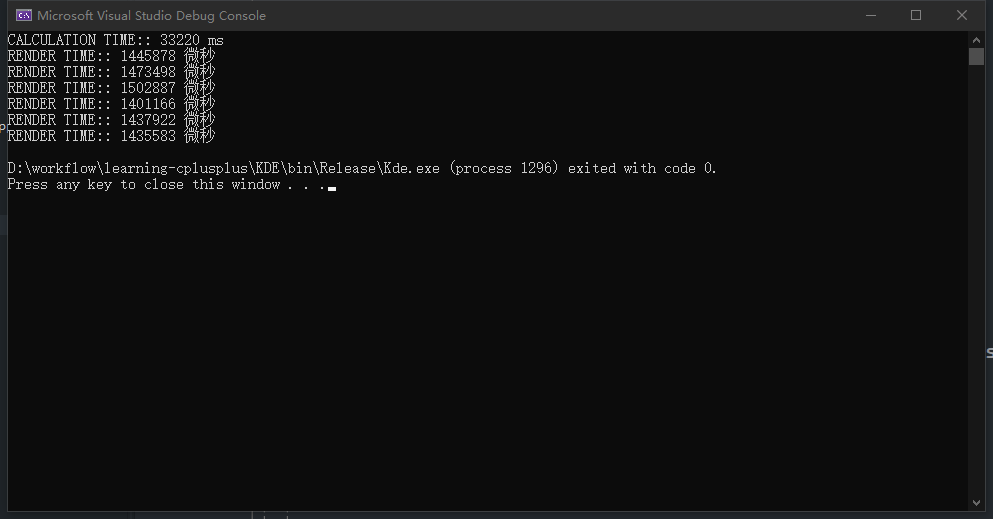
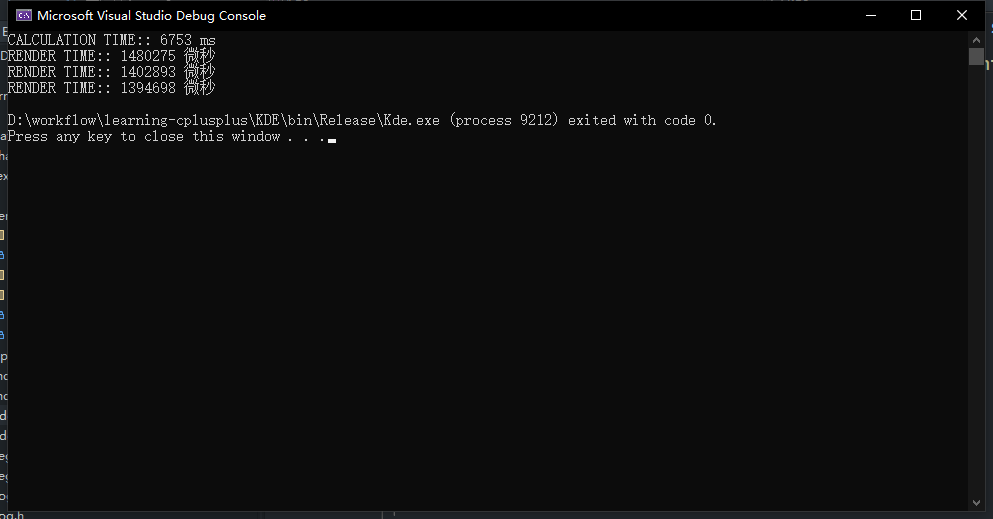
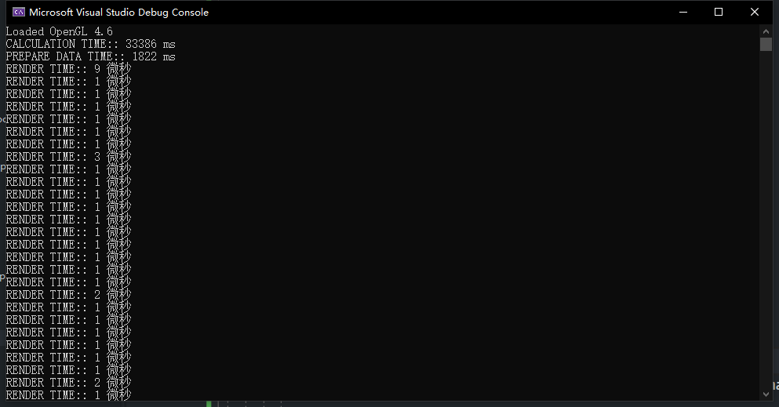
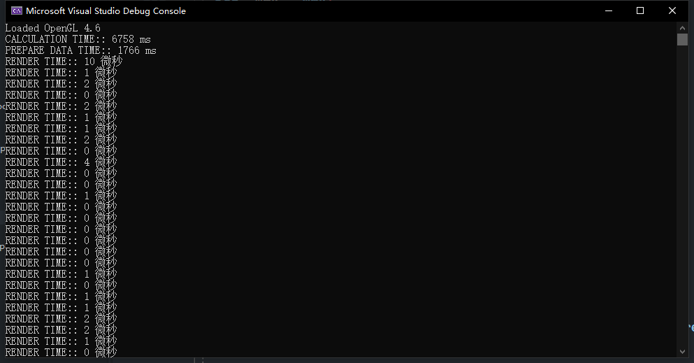

# GPU 加速实验

Relase 下：

A. 传统 OpenGL，无 CPU 多线程：

  10000 * 10000

    

B. 传统 OpenGL，有 CPU 多线程：

  10000 * 10000:  
    

C. 现代 OpenGL，无 CPU 多线程；

    

D. 现代 OpenGL，有 CPU 多线程：

  10000 * 10000:
  
    

E. 现代 OpenGL，GPU CUDA：

F. 现代 OpenGL，GPU OpenCL：

1000\*1000
5000\*5000
10000\*10000
15000\*15000
